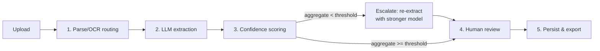

# Rebuild Spec — Human-in-the-Loop Document Extraction System

**How to use this document:** this is a self-contained implementation spec for the
architecture pattern used in this project — LLM extraction with a real confidence gate,
model escalation, and human review, over pluggable document types. Hand this file to a
fresh Claude session with no access to this repo and it has what it needs to build an
equivalent system in one pass, for this document type or a different one. Where a decision
was made for a specific reason, the reason is included — don't silently change a decision
without knowing why it was made.

If the new project's document type differs (not invoices), skip to
[Adapting to a new document type](#adapting-to-a-new-document-type) — the pattern is
designed for that; only Section 6 (extraction schema) and prompt text are type-specific.

---

## 1. Problem Shape (when this pattern applies)

You need to turn unstructured documents (PDFs, scans, images) into structured, human-verified
records, at a volume where 100% manual entry doesn't scale but 100% unchecked LLM output isn't
trustworthy either (financial documents, resumes, contracts, forms). The answer is: extract with
an LLM, score confidence for real (not the model's self-report alone), escalate only the
uncertain subset to a stronger/more expensive model, and route only what's still uncertain to a
human — so both LLM cost and human review time are spent proportional to actual risk, not spent
uniformly on every document.

## 2. Tech Stack (exact versions used)

**Backend**
```
fastapi==0.115.0
uvicorn[standard]==0.32.0
pydantic==2.9.2
pydantic-settings==2.5.2
sqlalchemy==2.0.35
alembic==1.13.3
psycopg2-binary==2.9.9
python-multipart==0.0.12
pymupdf==1.24.11          # digital PDF text-layer extraction
openai==1.51.0            # also used for non-OpenAI models via a compatible base_url
bcrypt==4.2.0
pyjwt==2.9.0
email-validator==2.2.0
pytest==8.3.3
paddlepaddle==3.3.1        # OCR — see Section 7 for the enable_mkldnn caveat
paddleocr==3.7.0
```

**Frontend**
```
react ^19.2, react-dom ^19.2, react-router-dom ^7.18, react-dropzone ^19.1, react-pdf ^10.4
typescript ~6.0, vite ^8.1
```
No state-management library — component state + React Context (auth) only. Plain `fetch`, no
axios/react-query.

**Infra**: Docker Compose — one container each for backend (FastAPI+Uvicorn), frontend
(Vite dev server), and `postgres:16-alpine`. Uploaded files on a local Docker volume (not object
storage — see Section 12 for when to change that). Three services, roughly:
```yaml
services:
  postgres:  { image: postgres:16-alpine, volumes: [pgdata:/var/lib/postgresql/data] }
  backend:   { build: ./backend,  ports: ["8000:8000"], volumes: [uploads:/app/uploads], depends_on: [postgres] }
  frontend:  { build: ./frontend, ports: ["5174:5173"], depends_on: [backend] }
```

**CORS is not optional and is easy to forget until the frontend mysteriously can't reach the
backend.** The Vite dev server's port isn't fixed (default 5173, but shifts if that port's taken),
so match by regex rather than a single hardcoded origin:
```python
app.add_middleware(
    CORSMiddleware,
    allow_origin_regex=r"http://localhost:\d+",
    allow_credentials=True, allow_methods=["*"], allow_headers=["*"],
)
```

**Backend settings** (`pydantic-settings`, loaded from `.env`) — the concrete list a rebuild needs
to define, not just the ones referenced elsewhere in this doc:
```
database_url, upload_dir
jwt_secret, jwt_algorithm (HS256), jwt_expiry_hours (7 days in this project)
confidence_escalation_threshold (0.75)
<llm_provider>_api_key, <llm_provider>_base_url, <first_pass_model>_deployment, <escalation_model>_deployment
```

**Tests**: a `backend/tests/` suite is expected, not optional — at minimum, cover the confidence
composite formula (self-reported/heuristic/escalation-cap math, not-applicable exclusion) and
schema validation (a malformed/edge-case payload against each extraction schema) directly as unit
tests, since those are the parts of the system where a silent off-by-one in the math is easy to
ship and hard to notice from the UI alone.

**Document status lifecycle** (explicit enum, referenced only via an arrow diagram elsewhere in
this doc — spelling it out here since a rebuild needs the literal set):
```python
class DocumentStatus(str, Enum):
    QUEUED = "queued"; PARSING = "parsing"; EXTRACTING = "extracting"
    ESCALATED = "escalated"; NEEDS_REVIEW = "needs_review"
    APPROVED = "approved"; FAILED = "failed"
```

**External LLM**: one provider resource exposing an OpenAI-SDK-compatible endpoint (Azure AI
Foundry in this project — `base_url` + `model=<deployment name>`, no separate client per
deployment) with two deployments: a cheap/fast model for the first pass, and a stronger model for
escalation only.

## 3. Architecture — 5 Pipeline Stages



Runs as a FastAPI `BackgroundTasks` job kicked off by the upload endpoint (returns immediately;
job updates `Document.status` as it progresses: `queued → parsing → extracting → escalated? →
needs_review`, or `failed` on an unrecoverable error).

**Stage 1 — Parse/OCR routing.** Per page: try direct text extraction (PyMuPDF `page.get_text()`).
If the result is under a small character threshold (≈20 chars — a bare page number shouldn't count
as "has text"), treat the page as scanned: render it to an image at ≥150–200 DPI (OCR accuracy
drops sharply below that) and run it through an OCR engine. **Run OCR in a separate worker process
(`ProcessPoolExecutor`, one worker, model loaded once)** — this is not optional. A CPU-bound OCR
call running in the same process as the API will pin the event loop and freeze every other
request (dashboard polling, unrelated uploads) for the full OCR duration. This project hit that
exact bug in production and fixed it by isolating OCR into its own process.

**Stage 2 — LLM extraction.** Call the fast/cheap model with the document's text and a Pydantic
schema as the structured-output target (`response_format={"type": "json_object"}` +
`schema_cls.model_json_schema()` in the system prompt). Validate the response against the schema.
On failure (bad JSON or schema violation): send exactly **one** repair prompt quoting the literal
validation error back to the model, then validate again. Fail the document cleanly if that also
fails — never retry unboundedly, never crash the pipeline process.

**Stage 3 — Confidence scoring & escalation.** Per field:
```
composite = 0.5 * self_reported_confidence + 0.5 * heuristic_score
```
- `self_reported_confidence`: ask the model to report its own 0–1 confidence per field in the
  same extraction call (don't trust this alone — models are frequently overconfident).
- `heuristic_score`: independent checks — format/regex validity, cross-field reconciliation
  (e.g. line items sum to the stated total), and for OCR'd pages, a **multiplicative discount by
  OCR confidence** (`heuristic_score * ocr_confidence`) since a value pulled off a badly-scanned
  page is less trustworthy even if it passes every other check.
- Fields marked "not applicable" to this document are **excluded from the aggregate**, not scored
  low — a genuinely absent field shouldn't be penalized like a failed extraction.
- If a document's aggregate composite is below an `escalation_threshold` (0.75 in this project),
  re-extract the whole document with the stronger model. Compute cross-model agreement **only for
  this escalated subset** (not every document) — a confirmed disagreement between the two models'
  values caps that field's confidence regardless of self-reported score, since disagreement is
  stronger evidence of a wrong value than one low self-report.
- **Never run both models on every document.** That was considered and rejected: it doubles LLM
  cost with no escalation benefit, since agreement-checking only matters where confidence is
  already in doubt.

**Stage 4 — Human review.** Every document reaches this stage regardless of score — **there is no
confidence-based auto-approval**. Confidence only decides which fields get visually flagged for
extra scrutiny. Review screen: original document next to editable fields, per-field confidence
shown, low-confidence fields visually flagged. Two actions: Approve (marks the document
done/approved) and Flag-for-follow-up (saves the same edits but leaves the document in a
still-needs-review state for a second pass). **Corrections must be written to their own
audit-trail table/rows, never overwriting the raw extraction** — this is what lets an accuracy
report compare raw-model accuracy against post-review accuracy from the same stored data.

**Stage 5 — Persist & export.** Every model call (first pass, and the escalation pass if one
happened) is stored as its own row, including the **prompt/completion token counts captured off
the API response** — this is the only correct basis for real cost figures later (see Section 9).
Export (JSON/CSV, single document or bulk per project) should use the raw extraction with each
field's **latest correction layered on top** — export the reviewed record, not the un-reviewed
model output.

## 4. Database Schema

Deliberately **not** a single "final record" table — raw extraction(s), confidence, and human
corrections are separate, queryable history, because accuracy has to be computable both
pre-review and post-review from the same stored data.

| Table | Key columns | Notes |
|---|---|---|
| `users` | `id, email (unique), password_hash, role (admin/user), created_at` | First signup auto-becomes admin; every account after that starts as `user`; only an existing admin promotes anyone. |
| `projects` | `id, name, document_type, owner_id (nullable FK→users), created_at` | `owner_id` nullable: pre-ownership legacy data, or a deleted user's leftovers, has no owner and is admin-visible only. |
| `documents` | `id, project_id (FK), filename, file_path, status, is_scanned, created_at, updated_at, parsing_started_at, parsing_completed_at, extraction_started_at, extraction_completed_at` | Per-stage timestamps back the dashboard's processing-time metrics — set them at real stage boundaries in the pipeline, not estimated. |
| `extractions` | `id, document_id (FK), model_name, raw_json (JSON), is_escalation (bool), prompt_tokens (nullable int), completion_tokens (nullable int), created_at` | One row per model call. Never updated after insert. |
| `field_confidences` | `id, document_id (FK), field_name, self_reported (float), heuristic_score (float), composite (float), escalated (bool), cross_model_agreement (nullable bool)` | One row per scored field per document. |
| `corrections` | `id, document_id (FK), field_name, corrected_value (Text — a corrected line-items value is JSON-encoded and can be long), reviewer (str), created_at` | The audit trail. Query the max `created_at` per `field_name` to get "current" corrected value. |

ORM cascade: `Project.documents` and `Document.{extractions,field_confidences,corrections}` should
cascade-delete (`cascade="all, delete-orphan"` in SQLAlchemy) so deleting a project/document cleans
up its children. **Caveat:** if there's no SQLAlchemy `relationship()` between `User` and
`Project` (only a raw `owner_id` FK column), the ORM has no dependency info to order a
multi-object delete within one flush — deleting a user's projects and the user in the same
transaction needs an explicit `db.flush()` between "delete the projects" and "delete the user", or
the FK constraint can fire depending on flush ordering. This project hit that bug for real.

## 5. Auth & Access Control

- Passwords: bcrypt. Sessions: stateless JWT (HS256, ~7 day expiry), decoded on every request via
  a FastAPI dependency — no server-side session store.
- Role is **never client-supplied**. First signup → `admin` automatically (count existing users;
  if zero, this one is admin). Every signup after that → `user`. Role changes only via an
  existing-admin-only endpoint.
- **One ownership rule, one place.** Write a single function/module that decides "can this user
  see this project" and reuse it in every route (projects, documents, dashboard, cost, whatever
  else is project-scoped) instead of duplicating an `owner_id == user.id` check per route:
  - Regular user: only their own projects.
  - Admin: their own projects **plus** any project with `owner_id IS NULL` (orphaned — never
    another active user's projects; admin is a role for user/data management, not blanket
    cross-tenant visibility).
- Document review/correction access follows project ownership, not role — any user who can access
  the project can review and correct its documents. Admin-only should be reserved for genuinely
  admin actions (user management), not gating routine review work.
- On deleting a user: **cascade-delete their projects/documents/files**, don't orphan them onto
  admin. (This project shipped the orphan approach first, then reversed it once it was obvious
  that handing a deleted user's reviewed documents to admin by default is a privacy regression,
  not a feature. Orphaning is still correct for the separate legacy-data case — projects that
  never had an owner to begin with.)
- The one endpoint that can't attach an `Authorization` header (a file/image URL used directly in
  an ``/PDF-viewer `src`) should accept the JWT as a query parameter as the *only* exception,
  still validated the same way as every other request.

## 6. Extraction Schema Pattern

Every concrete extraction schema inherits shared metadata fields so confidence scoring and the
repair-retry logic work generically across document types instead of hardcoding one schema:

```python
class FieldStatus(str, Enum):
    EXTRACTED = "extracted"
    NOT_APPLICABLE = "not_applicable"   # exists as a concept, doesn't apply to this doc
    ILLEGIBLE = "illegible"              # present but unreadable — different from "absent"

class ExtractionMeta(BaseModel):
    field_status: dict[str, FieldStatus] = Field(default_factory=dict)
    self_reported_confidence: dict[str, float] = Field(default_factory=dict)
```

A null value alone is ambiguous (model failed to find it vs. field doesn't exist on this
document) — collapsing both into `None` corrupts confidence scoring (a genuinely absent field
would get penalized like a failed extraction) and any accuracy report against ground truth.

This project's two concrete schemas, as real examples of the pattern:

```python
class LineItem(BaseModel):
    description: str
    quantity: float | None = None
    unit_price: float | None = None
    line_total: float | None = None

class InvoiceExtraction(ExtractionMeta):
    invoice_number: str | None = None
    invoice_date: date | None = None
    due_date: date | None = None
    vendor_name: str | None = None
    customer_name: str | None = None
    subtotal: float | None = None
    tax_amount: float | None = None
    total_amount: float | None = None
    line_items: list[LineItem] = Field(default_factory=list)

class ResumeExtraction(ExtractionMeta):
    full_name: str | None = None
    email: str | None = None
    phone: str | None = None
    professional_summary: str | None = None
    skills: list[str] = Field(default_factory=list)
    work_experience: list[WorkExperience] = Field(default_factory=list)   # company, title, start_date, end_date, description
    projects: list[ResumeProject] = Field(default_factory=list)           # name, description, technologies
    education: list[Education] = Field(default_factory=list)              # institution, degree, field_of_study, graduation_year
```

**A single registry module** maps `document_type → (schema_cls, prompt_intro)` so the pipeline,
extraction service, and confidence scorer all dispatch through one place instead of hardcoding a
schema per call site:

```python
EXTRACTION_SCHEMAS = {
    "invoice": (InvoiceExtraction, INVOICE_PROMPT_INTRO),
    "resume": (ResumeExtraction, RESUME_PROMPT_INTRO),
}
def get_extraction_schema(document_type: str):
    return EXTRACTION_SCHEMAS[document_type]
```

Prompt intro text (per type) instructs the model explicitly on the three-way `field_status` and to
never guess a value to fill a field ("a wrong guess is worse than null").

## 7. API Surface (authoritative — from the running system's OpenAPI)

```
POST   /auth/signup                                  → {access_token, user}
POST   /auth/login                                   → {access_token, user}
GET    /auth/me                                       → current user

GET    /projects                                      → list, scoped to caller
POST   /projects              {name, document_type}   → created project
GET    /projects/{id}
DELETE /projects/{id}                                  → also deletes its documents' files on disk

POST   /projects/{id}/documents      multipart file    → queues background pipeline, returns immediately
GET    /projects/{id}/documents      ?status&limit&offset
GET    /projects/{id}/documents/export   ?format=json|csv   → bulk export, reviewed record

GET    /documents/{id}                                 → full detail incl. latest extraction + confidence
DELETE /documents/{id}
GET    /documents/{id}/export        ?format=json|csv
GET    /documents/{id}/file          ?token=<jwt>       → the only query-param-auth exception
POST   /documents/{id}/corrections   {corrected_fields, approve}

GET    /dashboard             ?project_id              → stats, globally or scoped to one project
GET    /cost                                            → per-project cost for caller; admin also gets per-user breakdown + grand total

GET    /users                                           → admin only
PATCH  /users/{id}/role       {role}                    → admin only
DELETE /users/{id}                                       → admin only; cascades their data (Section 5)
```

## 8. Cost Tracking

Capture `usage.prompt_tokens` / `usage.completion_tokens` off **every** API response (both the
first-pass and repair-retry call if one happens — sum them, since both cost money) and store them
on the `extractions` row. Price them from configurable $/1M-token rates (one input/output pair per
deployment — cheap model and escalation model have very different rates, especially on output
tokens), so cost is **measured from real usage**, not estimated after the fact:

```python
def extraction_cost(is_escalation, prompt_tokens, completion_tokens) -> float:
    input_price, output_price = ESCALATION_RATES if is_escalation else FIRST_PASS_RATES
    return (prompt_tokens * input_price + completion_tokens * output_price) / 1_000_000
```

Expose per-project cost to any user scoped to their own projects; admin additionally gets a
per-owner breakdown across every user plus the grand total. An escalated document can cost an
order of magnitude more than a non-escalated one (mostly the stronger model's output-token rate)
— this is exactly why the escalation gate in Section 3 matters for cost, not just accuracy.

## 9. Frontend Structure

Routes (React Router):
```
/login, /signup                                    — public
/                    Overview      — global stats (admin sees +total users)
/projects            Projects      — grid of project cards + "create project"
/users               Users         — admin only, client-side redirect-guarded too
/types                FormTypes    — static list of document types + fixed field sets
/cost                 UsageCost    — per-project + (admin) per-user cost
/projects/:id/upload  Upload       — dropzone + document queue + bulk export buttons
/projects/:id/documents/:docId   DocumentDetail → ReviewScreen
```
`/projects/:id` alone (no sub-page) should redirect straight to `/projects/:id/upload` — don't
build a separate per-project dashboard page; it's a real page nobody asked for once Upload/Queue
already exists. Clicking a project card should go straight there too.

Key components: `TopNav` (role-aware nav links), `ProjectList` (grid + create-project modal),
`Queue` (document list with per-status badge + Review/Delete), `ReviewScreen` (tabbed sections per
extraction schema — hardcode which fields go in which tab per document type, e.g. invoice:
Overview/Parties/Amounts/Line Items), `DocumentSidebar` (sibling documents in the same project),
`UploadDropzone`.

**Navigation history gotcha:** if a "Back" button uses `navigate(-1)`, and switching between
sibling documents in a sidebar also pushes a new history entry each time, clicking Back cycles
through every previously-viewed sibling before finally reaching the project list. Either navigate
to an explicit destination (`navigate('/projects/:id/upload')`) instead of relying on browser
history, or make sidebar navigation use `{ replace: true }` so it doesn't accumulate entries in the
first place. Do both.

Auth: React Context wrapping the app, JWT in `localStorage`, attached as `Authorization: Bearer`
on every request via a shared `fetch` wrapper. A plain `fetch` has no default timeout — wrap it
with an `AbortController` timeout so a slow backend fails fast with a clear message instead of the
page hanging blank.

## 10. Branding

Define the palette once as CSS custom properties, referenced everywhere — never hardcode a brand
color per component. This project's palette (swap for a different brand):
```
--brand-navy: #182127        --accent: #d9591a (light) / #ff9452 (dark)
--bg: #f7f7f8 (light) / #16171d (dark)      --border: #e2e2e6 / #2e303a
--text: #1c1c1f / #e8e8ea                    --text-muted: #6b6b74 / #9a9aa4
```
Support both light and dark theme via `prefers-color-scheme` plus a manual toggle that stamps a
`data-theme` attribute overriding it.

## 11. Known Pitfalls (from this project's real history — don't re-derive these the hard way)

1. **OCR blocking the API.** Synchronous OCR inference in the same process as the API freezes
   every other request for the OCR call's full duration. Isolate it in its own worker process
   from the start (Section 3, Stage 1).
2. **User↔Project delete ordering.** No `relationship()` between User and Project means the ORM
   won't order a same-transaction delete correctly — flush explicitly between the two deletes
   (Section 4).
3. **Union types on a corrections/patch endpoint must include every real value shape.** A
   `corrected_fields: dict[str, str | float | None | list[dict]]` type will 422 on a field whose
   corrected value is actually `list[str]` (e.g., a resume's skills list) — include every shape
   your schemas can actually produce, not just the ones you tested with.
4. **`navigate(-1)` + a UI that also pushes history entries** = broken Back button (Section 9).
5. **Corrections need to actually get merged back into what the UI/export shows.** If "get
   document detail" always returns the raw extraction and never layers corrections on top, a
   reviewer who corrects and approves a document will see the *original* uncorrected values again
   next time they open it — decide up front whether "current value" means raw-extraction-with-
   corrections-applied everywhere it's displayed (recommended), not just in export.
6. **A `NavLink` matching by path prefix will stay "active" on nested routes it shouldn't.** Use
   the router's exact-match option on top-level nav items whose paths are prefixes of nested
   routes (e.g. `/projects` vs `/projects/:id/documents/:docId`).

## 12. Scaling Beyond a Single Instance

In order of when they'd actually start to matter:
1. **Job queue.** In-process `BackgroundTasks` doesn't survive a process restart and doesn't
   distribute across API replicas — move pipeline execution to Celery+Redis (or equivalent) once
   there's more than one API instance.
2. **OCR worker pool.** Already isolated to its own process (Section 3) — next step is running
   that pool on separate CPU-optimized instances, since OCR is the CPU-bound stage and LLM calls
   are I/O-bound.
3. **Stateless API replicas behind a load balancer**, Postgres connection pooling (PgBouncer) —
   the API holds no state beyond the JWT it decodes per request, so this is pure horizontal
   scale-out.
4. **Object storage** for uploaded files once more than one instance needs to serve the same file.

## Adapting to a New Document Type

1. Add a new Pydantic schema inheriting `ExtractionMeta` (Section 6) with that document type's
   fields — nothing else in the pipeline, confidence scorer, or repair-retry logic needs to change,
   they all dispatch through the schema registry.
2. Write its prompt intro (same three-rule shape: not-applicable / illegible / extracted +
   self-reported confidence, never guess).
3. Add one entry to the schema registry dict.
4. Add any type-specific heuristic reconciliation checks (e.g. this project's "line items sum to
   subtotal" check) — guard them with `getattr`/`hasattr` so they simply don't fire for schemas
   without those field names, rather than hardcoding a dependency on one schema.
5. Add a frontend section/tab config for that type's review screen (which fields group into which
   tab) — everything else in `ReviewScreen` (confidence display, correction submission, table vs.
   plain-field rendering) is already generic.
6. Add the type to the selectable document-type enum; mark it implemented once its schema exists.
